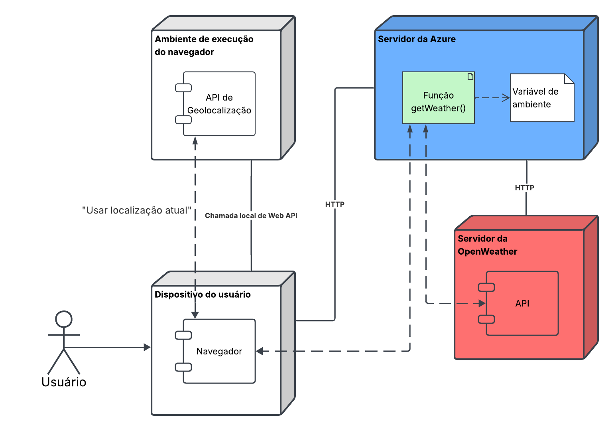

# SnapClima

O SnapClima é uma página web para consultar informações meteorológicas em tempo real de uma localização (cidade, estado, país) digitada pelo usuário ou da localização atual do mesmo, identificada automaticamente por meio da latitude e longitude.

Variáveis meteorológicas exibidas:

- Condição do tempo;
- Temperatura (ºC ou ºF);
- Velocidade dos ventos;
- Sensação térmica (ºC ou ºF);
- Umidade;
- Horário do nascer do sol;
- Horário do pôr do sol.

## Funcionalidades

### Principais

- Buscar atuais dados meteorológicos
    - de localização digitada na barra de pesquisa;
    - de localização atual do usuário.

### Utilitárias

- Trocar tema da página (claro ou escuro);
- Trocar unidade de medida das temperaturas (ºC ou ºF).

## Utilizar aplicação
Você pode testar a aplicação diretamente no navegador, sem baixar nada. Acesse [clicando aqui](https://snapclima-one.vercel.app/).

## Tecnologias utilizadas

- Frontend: HTML, CSS, Javascript;
- Hospedagem da página: Vercel; 
- Cloud e função sem servidor: Azure e Java 21.

## Arquitetura

