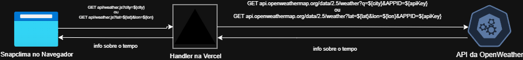

# Snapclima

O Snapclima é uma página web para consultar informações meteorológicas em tempo real de uma localização (cidade, estado, país) digitada pelo usuário ou da localização atual do mesmo, identificada automaticamente por meio da latitude e longitude.

Variáveis meteorológicas exibidas:

- Condição do tempo;
- Temperatura (ºC ou ºF);
- Velocidade dos ventos;
- Sensação térmica (ºC ou ºF);
- Umidade;
- Horário do nascer do sol;
- Horário do pôr do sol.

## Tecnologias utilizadas

- HTML, CSS, Javascript
- Hospedagem na Vercel

## Funcionalidades

### Principais

- Busca por nome de local;
- Busca utilizando localização atual do usuário.

### Utilitárias

- Trocar tema da página (claro ou escuro);
- Trocar unidade de medida das temperaturas (ºC ou ºF).

## Esquema visual da aplicação

